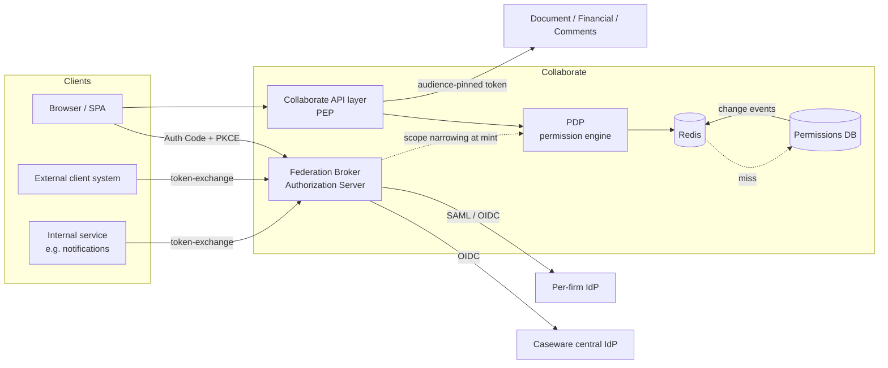

# Collaborate — Identity & Authorization Layer

**Design Document** · Senior Developer, Collaborate

## Scope & Assumptions

- Caseware's central IdP is an external OIDC dependency (discovery / token / userinfo). Not built here.
- Credential storage and MFA are out of scope; this is the authorization layer around the IdP.
- Workspace roles, resource-level overrides, and firm policy live in Collaborate's database, which can emit change events.
- Downstream services (Document, Financial Data, Comments) validate tokens only. They never read the permissions database.
- Redis (ElastiCache) and AWS infrastructure are available.

---

## 1. High-Level Architecture

Three components, each owning one of the three problems.



### A. Federation Broker (Authorization Server)

Collaborate runs its own OAuth2/OIDC AS. It is the **only issuer downstream services trust**. It federates upstream per firm: firm staff to Caseware's central IdP, external users to their own firm's SAML or OIDC IdP. Authorization Code + PKCE runs between the client and our AS; the upstream handshake is a separate, internal concern.

**Why not let clients take tokens directly from each IdP?** Every downstream service would then have to trust N issuers with differing claim shapes, and N grows with every firm onboarded. More decisively, SAML produces an XML assertion, not an OAuth access token — a translation step is required no matter what. Doing it once in the broker beats doing it three times in the resource services.

Per-firm configuration (issuer, client credentials or SAML metadata, claim mapping, redirect URIs) lives in Collaborate's DB, cached in front. Firm is resolved **before** redirect from the workspace or invite context already present in the URL, with email-domain home-realm discovery as the fallback for generic entry points.

*ASP.NET Core detail:* authentication schemes are registered dynamically at firm onboarding through `IAuthenticationSchemeProvider`. Routine config changes (secret rotation, cert renewal) do **not** re-register — a change event evicts the entry from `IOptionsMonitorCache<T>` and the next request rebuilds it from current values. Registration is a firm-lifecycle operation; options refresh is a config-change operation.

### B. Policy Decision Point (permission engine)

Access tokens carry **identity and coarse scope only**. Fine-grained state — workspace role, resource-level overrides, firm policy — is resolved per request by the PDP.

The governing rule: **if a fact can change between the moment a token is minted and the moment it is used, it does not belong in the token.** Embedding permissions would make token lifetime the revocation SLA, and per-document overrides cannot be enumerated into a header anyway.

The PDP caches **inputs, not decisions**:

```
perm:{userId}:{workspaceId} → { role, resourceOverrides[], firmPolicyVersion }
```

One Redis read, then a pure in-process function maps (role, overrides, firm policy, resource, action) to permit/deny. Caching resolved decisions instead (`can:{user}:{resource}:{action}`) would explode cardinality, turn a single role change into thousands of key deletions, and move authorization logic into cache state where it cannot be unit-tested.

**Invalidation** is by delete, never update — the next read repopulates from the source of truth, so a bug in an update path can never leave the cache disagreeing with the database. DB change hooks publish events; a role change or removal deletes one key. Firm policy changes would otherwise touch every user in the firm, so cached entries carry a `firmPolicyVersion` stamp and a mismatch is treated as a miss — mass invalidation becomes a counter bump rather than a key scan.

**Enforcement sits at Collaborate's API layer (the PEP)**, which consults the PDP and then calls downstream services with an audience-pinned token. Downstream services accept *only* tokens minted by our AS for their own audience, so a client cannot bypass the PEP by calling Document Service directly. The PDP is additionally exposed over HTTP for services that genuinely need to ask.

**Long-lived sessions** (open collaborative editing) are not covered by request-path enforcement — after the handshake, the request path never sees that connection again. Those connections subscribe to the same revocation event stream and are force-rechecked or dropped.

### C. On-Behalf-Of (RFC 8693 Token Exchange)

One endpoint and one rule set serves both delegation scenarios. The caller presents its own client credentials plus a `subject_token`; the AS returns a JWT with `sub` = the user, `act` = the calling party, `aud` pinned to one downstream service, and narrowed scope.

Four controls prevent confused deputy — all four, not a subset:

| Control | Failure if omitted |
|---|---|
| **Audience pinning** — `aud` is exactly one service | A token minted for notifications replays against Financial Data |
| **Scope narrowing as intersection** — `requested ∩ subject token ∩ client ceiling ∩ current PDP` | Privilege escalation |
| **Actor entitlement check** — may this client act for this user? | The classic omission; this is where the vulnerability lives |
| **Short lifetime** (60–300s) | Requires revocation infrastructure for exchanged tokens |
| **Delegation depth cap** — one hop, counted from nested `act` claims | A delegated token is re-delegated onward toward a higher-trust audience |

**Two deliberate deviations from RFC 8693.** The spec makes `audience` optional (§2.1); we require it, because an unpinned token is the confused-deputy problem restated — no audience, no token. And §4.4's `may_act` claim, the spec's own mechanism for recording who may act for a subject, is not used: an embedded claim freezes the decision at issue time, which is exactly the staleness this design avoids everywhere else. The entitlement lookup runs at exchange time instead, so a withdrawn authorization takes effect immediately. One rule falls out of the same reasoning: when no scope survives the intersection the exchange refuses, rather than issuing a scopeless token that a downstream service might read as unrestricted.

The sharp edge is scenario (a), an external client acting for its own employee: **a client must be structurally incapable of acting for a user outside its own firm.** The client record already carries `firmId` from the broker design, so the exchange refuses when `subject.firmId ≠ client.firmId`. This is a structural invariant with a dedicated test, not a policy row someone can misconfigure. First-party internal services that legitimately act across firms are modelled as an explicit, separately-named actor constraint rather than a special case of the same check.

The exchange consults the PDP at mint time, so scope reflects what the user can do *now*. That, plus the short lifetime, is how "fast" and "consistent with the source of truth" are reconciled — and it keeps the exchange a PDP consumer rather than a second source of truth.

---

## 2. Implementation Plan

| Phase | Deliverable |
|---|---|
| 1 | Broker AS with the central-IdP path only; per-firm client store; PKCE. Downstream services switched to trusting one issuer. |
| 2 | Per-firm federation: dynamic scheme registration, claim mapping, one pilot firm (OIDC, then SAML). |
| 3 | PDP: pure evaluation function, Redis cache, DB change hooks, PEP in the API layer. Shadow-mode first — evaluate and log, enforce nothing. |
| 4 | Enforcement on, plus revocation event fanout to long-lived connections. |
| 5 | Token exchange endpoint; migrate internal services off token forwarding. |

Phase 3's shadow mode matters: it lets the decision function be validated against real traffic before any request can be denied by it.

**Library choice (open):** Duende IdentityServer is more mature with commercial support, but is licensed per registered client application — the same axis this system grows along, since per-firm client configuration means firm onboarding drives client count. OpenIddict has no licensing cost at any scale, at the price of hand-building login/consent surfaces. Note that RFC 8693 is a custom grant handler in *both* — neither ships it natively — so the exchange work is identical either way.

## 3. Testing Strategy

- **Pure functions, table-driven.** Scope intersection and the permission evaluator are pure by construction, so the full matrix (role × override × firm policy × action) is testable with no infrastructure. This is deliberate: the security-critical logic is the part that needs exhaustive coverage, so it is the part kept free of I/O.
- **Negative tests as first-class.** Cross-firm delegation refused; scope escalation refused; token replayed at the wrong audience refused; expired subject token refused; a scope the user has *lost* dropped even though the subject token still carries it. That last one is the test that proves PDP consultation actually happens at mint time.
- **Invalidation timing.** Assert that a permission change propagates to a denied decision within the target window, measured, not assumed.
- **Integration** with test-signed tokens and an in-memory client registry; no live IdP required.
- **Load test** the PDP at target throughput with a realistic key distribution, including a deliberate hot-workspace case.

## 4. Evaluation & Observability

The requirement "revocation takes effect within seconds" is an aspiration unless it is measured. The primary SLI is **propagation lag: permission-change commit → cache invalidated → connected sessions re-checked**, tracked as a distribution, alerted on p99.

Supporting signals:

- PDP decision latency p50/p99, and cache hit ratio.
- **Denies by reason.** A spike is either a misconfiguration or an attack; both warrant a page.
- **Cross-firm refusals at the exchange endpoint should be ~0.** Any non-zero rate is either a broken integration or an attempted confused-deputy attack, and is worth investigating individually rather than graphing.
- DB fallback rate and circuit-breaker state, as the early warning for cache degradation.
- **Immutable audit log of every exchange**, recording `sub` and `act` — attributability to the specific user is a stated requirement, not just a debugging aid.

## 5. Failure Modes & Tradeoffs

| Failure mode | Response |
|---|---|
| **Redis unavailable** | Fall back to the DB behind a circuit breaker, with single-flight coalescing — without it a cache outage converts directly into a database outage. Fail *closed* only when the DB is also unreachable. |
| **Invalidation event lost** | Event delivery is the fast path, not the only path: cached entries also carry a modest TTL so a dropped event self-heals within a bounded window instead of persisting indefinitely. |
| **AS unavailable** | It is a single point of failure by construction. Multi-AZ, stateless, horizontally scaled; degradation blocks new logins but does not invalidate live sessions. |
| **A firm's IdP is down** | Blast radius contained to that firm — the direct-federation alternative would have spread this across every downstream service. |
| **Clock skew** | Short-lived exchanged tokens are the most skew-sensitive component; require NTP and allow a small, explicit validation skew. |

**Accepted tradeoffs.** Cached authorization means a staleness window exists by definition; the design bounds and measures it rather than pretending otherwise. Enforcing at the API layer keeps downstream services simple but makes that layer security-critical. And scope narrowing distinguishes two cases deliberately: a scope the subject token never had is an escalation attempt and fails loudly, while a scope the user has *since lost* is dropped silently and reported back in the response — the first is an attack signal worth surfacing, the second is ordinary staleness that should not break a legitimate integration.

**Where I would not trust AI on this system.** Authorization logic fails silently and permissively — a scope-narrowing bug does not throw, it grants. Generated code here reads plausibly and is wrong in ways tests must catch rather than review. The intersection logic, the firm-boundary invariant, and anything touching token validation are the places to write the tests first and treat generated implementations as drafts to be verified against the RFCs.
